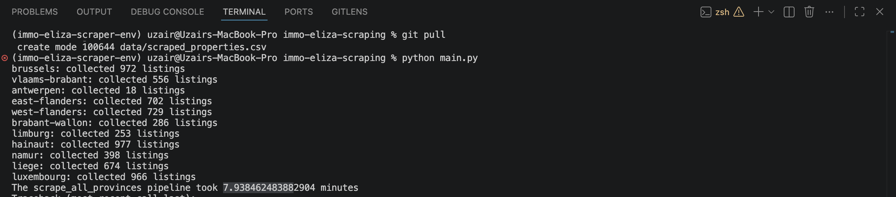
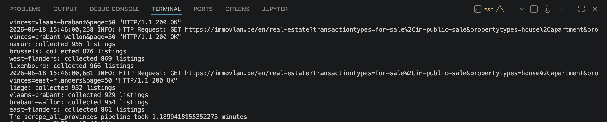
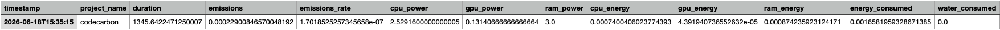

# Real Estate Scraper: Immo Eliza-scraping

## Team

Developed by **Team Polar(s) Bears** as part of the Immo Eliza project.

Team members:

| Name | Role |
|------|------|
| Iness | Project Lead |
| Uzair | Git Commander |
| Guillermo | Data Architect |
| Hiba | Documentation Specialist |

We were initially the Pandas, but after deciding to switch from the Pandas library to Polars, we became the Polar(s) Bears.

## Description

This project is part of the **Immo Eliza** real estate data pipeline.

The goal is to build a complete scraping pipeline to collect and enrich real estate data in Belgium in order to create a dataset for future machine learning models predicting property prices.

The pipeline collects information from **Immovlan**, gathers data from around 10,000 properties across Belgium, computes additional geographical features, and exports the final dataset in CSV format.

Main components:

* Property listing extraction
* Property detail scraping
* Asynchronous scraping
* Geographical feature engineering
* Dataset processing and export

---

## Project Structure

```
.
├── assets/
│   ├── carbon_emission.png
│   ├── runtime_after_async.png
│   ├── runtime_before_async.png
│
├── data/
│   ├── emissions.csv
│   ├── powermetrics_log.txt
│   ├── property_listings.csv
│   └── scraped_properties.csv
│
├── dev/
│   └── exploratory notebooks
│
├── src/
│   ├── async_utils.py
│   ├── property_details_scraper.py
│   ├── property_listings_scraper.py
│   └── utils.py
│
├── .gitignore
├── main.py
├── README.md
└── requirements.txt

```

---

## Pipeline Overview

The pipeline is executed through `main.py`:

```
Scrape property listings (async, all provinces)
          |
          v
Save listings to property_listings.csv
          |
          v
Reload listings CSV → extract property URLs
          |
          v
Scrape property details for each URL (async)
          |
          v
Join listings + details on property_id
          |
          v
Export final dataset to scraped_properties.csv
```

---

## Modules

### main.py

Entry point of the project.

It:

* collects property listings;
* launches the detail scraping pipeline;
* merges listing and property information;
* exports the final dataset.

Run:

```bash
python main.py
```

---

### property_listings_scraper.py

Responsible for collecting property URLs and basic information from Immovlan.

Extracted information includes:

* property ID
* URL
* location
* postal code
* property type
* contract type

---

### property_details_scraper.py

Scrapes detailed information from individual property pages.

Collected data includes:

* price
* property characteristics
* energy information
* facilities
* accessibility distances
* coordinates

---

### geo_utils.py

Adds geographical features:

* driving distance to Brussels using OSRM
* distance to nearest Belgian city using geographical coordinates

---

### async_utils.py

Handles concurrent scraping of multiple property pages.

It improves performance by scraping several pages simultaneously while limiting the number of active requests.

---

## Performance: Synchronous vs. Asynchronous Scraping

The listing scraper was migrated from a synchronous to an asynchronous implementation (`async_utils.py`) to speed up data collection across all 10 Belgian provinces.

**Before (synchronous):**



The synchronous run took close to **8 minutes** to scrape all provinces and produced inconsistent listing counts per province (e.g. only 18 listings for Antwerpen), suggesting requests were sometimes failing or getting cut short.

**After (asynchronous):**



After switching to concurrent requests, the same full-province scrape completed in roughly **1.2 minutes**, around a **6-7x speedup**, with consistent listing counts collected across every province.

---

## Data Output

The pipeline generates:

### property_listings.csv

Contains basic information about each property:

* URL
* property ID
* location
* property type

### scraped_properties.csv

Final enriched dataset containing:

* listing information
* property features
* geographical features
* accessibility information

---

## Development

The `dev/` folder contains exploratory notebooks used for:

* testing scraping functions
* data exploration
* feature validation

---

## Carbon Emissions Tracking

The pipeline uses **codecarbon** (via `emissions.py`) to track the environmental footprint of each scraping run.



A sample run logged the following:

| Metric | Value |
|--------|-------|
| Duration | ~1345 s (~22.4 min) |
| Emissions | ~0.000229 kg CO2eq |
| Emissions rate | ~1.70e-07 kg/s |
| CPU power | 2.53 W |
| GPU power | 0.13 W |
| RAM power | 3.0 W |
| Water consumed | 0.0 L |

This lets the team monitor and compare the sustainability impact of pipeline changes, such as the move to asynchronous scraping above.

---

## Main libraries

* asyncio
* codecarbon
* beautifulsoup4
* httpx
* lxml
* polars

---

## How to run the project

1. Install dependencies:

```bash
pip install -r requirements.txt
```

2. Run the application:

```bash
python main.py
```

3. The final dataset is generated at:

```
data/scraped_properties.csv
```